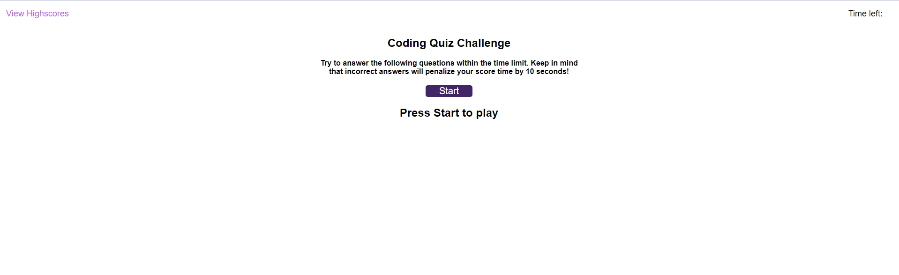

# Tybalt Mallet's Coding Quiz Challenge

## Description
This is the Module 4 challenge for the fourth week of the UCB coding camp. For this weeks challenge we had to create a website hosting a coding quiz from scratch, with only a gif of a completed website to go off of. We had to use what we learned this week about webAPIs to store the data from our tests locally, as well as changing elements and styles through javascript as the user progresses from one page to the next through the quiz. When the user begins the quiz, a timer starts on the top right, and every answer they get wrong in the 5 question tests takes off 10 seconds from the timer, and your final score is based on the amount of time left, so it is essentially a quiz of who can get the most answers accurately the fastest. At the end of every game the user is then prompted to input their initials, and their highscores and initials will be saved to a leaderboard locally, and sorted in the proper order, so even if the page is refreshed or if multiple people want to play and compare high scores, the website will function perfectly. The user is also able to clear the high scores, play again once their game is finished, or go directly to the high score leaderboard at anytime on the website. 
## Project Link

https://notuneeven.github.io/Coding-Quiz-Challenge/

## Screenshot of Website

## Usage 

This website can be used as a way to compare peoples knowledge of basic JavaScript against one another, through a short timed quiz. It will also as usual be a great way for me to come back and study the basics of JavaScript and web API's in the future, as looking at the code filled with comments explaining how things work and why, it will be very easy for me to see the direct correlation between code and it's effect on the website. 

## Credits 

N/A

## License 

N/A
